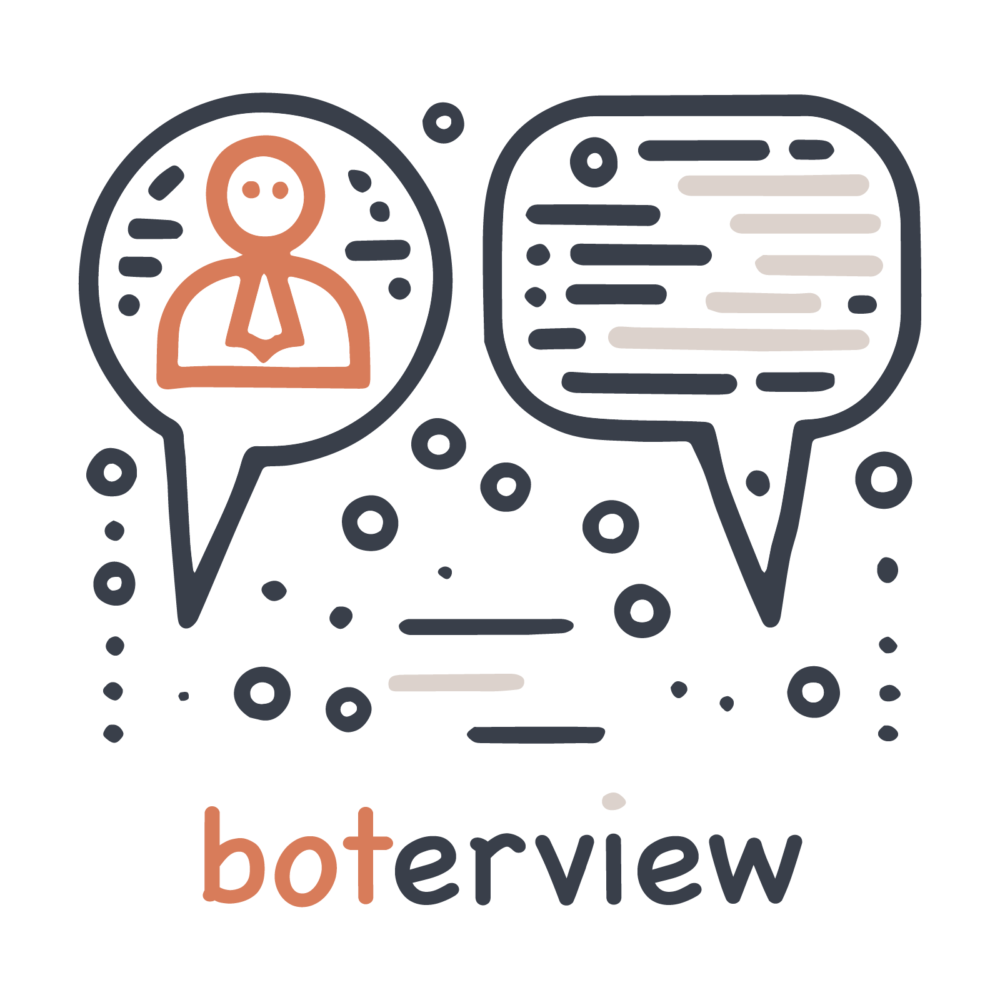

<p align="center">
    <a href="https://boterview.mihaiconstantin.com">
        
    </a>
</p>

<h1 align="center">
    <sub>AI-based interview studies...<br>...as smooth as butter</sub>
</h1>

<!-- badges: start -->
<p align="center">
    <a href="https://www.repostatus.org/#wip"></a>
    <a href="https://github.com/mihaiconstantin/boterview/releases"></a>
    <a href="https://boterview.mihaiconstantin.com"></a>
    <a href="https://raw.githubusercontent.com/mihaiconstantin/boterview/main/assets/design/boterview-design.svg"></a>
</p>
<!-- badges: end -->

`boterview` is a `Python` package that enables social science researchers to
easily deploy chatbot-based interviews with customizable protocols and
randomized condition assignment.

## Installation

You can install the development version of `boterview` from `GitHub`, and once
the package reaches a stable version, directly from the `PyPI` repository.

*Optional.* You may choose to create a new `Python` virtual environment.

```bash
# Create a new directory for your study.
mkdir my-study

# Move into the directory.
cd my-study

# Create a new `Python` virtual environment called `.venv`.
python -m venv .venv

# Activate the virtual environment.
source .venv/bin/activate
```

At this point, you can safely install the package from `GitHub`.

```bash
# Install using `pip`.
pip install boterview@git+https://github.com/mihaiconstantin/boterview
```

## Usage

To use `boterview`, you need to specify the configuration of your study. You can
do so using the class API (i.e., see the [design diagram](#todo)), or more
simply via a `TOML` configuration file.

The example below shows how to configure a study using a `TOML` configuration
file. Suppose you are interested in setting up a study conducting interviews
with participants randomly assigned to one of two conditions, where each
condition uses a different interview guide. You can achieve this in a
`study.toml` file as follows:

```toml
# The `bot` section contains key pertaining to the LLM used.
[bot]
api_key = "OpenAI API key or name of environment variable"
model = "gpt-4o"

# The `study` section is used to, well, configure the study.
[study]
name = "Study Name"

# Set the first condition (e.g., with a specific interview guide).
[[study.conditions]]
name = "Condition 1"
prompt = "path/to/prompt.md"
protocol = "path/to/protocol.md"
introduction = "path/to/introduction.md"
closing = "path/to/closing.md"
guide = "path/to/guide-condition-1.md"

# Set the first condition (e.g., with a specific interview guide).
[[study.conditions]]
name = "Condition 2"
prompt = "path/to/prompt.md"
protocol = "path/to/protocol.md"
introduction = "path/to/introduction.md"
closing = "path/to/closing.md"
guide = "path/to/guide-condition-2.md"
```

**_Note._** For flexibility, `boterview` allows you to specify the different
parts of the interview (i.e., including the system model prompt) in separate
files. This way, you can easily reuse parts of the study to avoid needless
error-prone repetition, and `boterview` will take care of dynamically
constructing the entire interview.

At this point, you can interact the `boterview` via the command line interface
(CLI) to perform any of the supported operations. Currently, you can preview the
interview for any of the study conditions specified in the configuration file.

```bash
# Preview a condition.
boterview preview --config study.toml --condition "Condition 1"
```

Additionally, you can run the study using the `boterview` CLI.

```bash
# Run the study.
boterview run --config study.toml --port 8080
```

**_Note._** `boterview` is very much a work in progress, and we are keen on
expanding it to support more operations and features. See the *Contributing*
section below for more information on how you can help.

## Contributing

- Any contributions are welcome and greatly appreciated. Please open a [pull
  request](https://github.com/mihaiconstantin/boterview/pulls) on `GitHub`.
- To report bugs, or request new features, please open an
  [issue](https://github.com/mihaiconstantin/boterview/issues) on `GitHub`.

## License

The package source code in this repository is licensed under the [MIT
license](https://opensource.org/license/mit).
